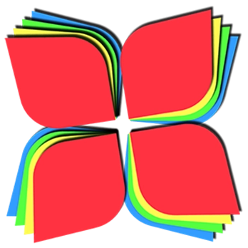
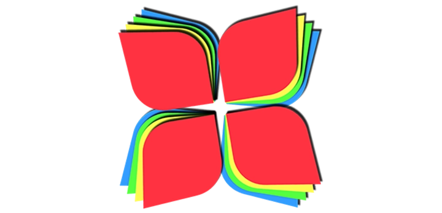

<p align="center">
  
</p>

<h1 align="center">LiveWallpaper for macOS</h1>

<p align="center">
  <strong>A lightweight, premium utility to bring your macOS desktop to life with live video wallpapers.</strong>
</p>

<p align="center">
  <a href="https://developer.apple.com/swift/"></a>
  <a href="https://apple.com"></a>
  <a href="LICENSE"></a>
</p>

---

## 🌟 Overview

**LiveWallpaper** is a minimalist yet premium native macOS application written in Swift. It lets you set any video file as a fully looping, high-performance live desktop wallpaper. The utility resides cleanly in your system menu bar (tray) and features a fluid, glassmorphic HUD interface built strictly with native AppKit and AVFoundation components.

<p align="center">
  
</p>

---

## ✨ Features

- 🖥️ **Multi-Monitor Harmony:** Automatically spans and fits your live wallpaper across every connected display.
- 🔄 **Unconditional Looping:** Wallpapers play seamlessly and loop infinitely for a perfect presentation.
- 🎛️ **Dynamic Menu Bar Item:** A reactive tray icon that automatically toggles between `Play` and `Pause` states depending on your wallpaper's playback status.
- 🔉 **Integrated Audio Control:** Toggle wallpaper audio outputs on and off instantly.
- ⚡ **Variable Playback Speed:** Fine-tune video speeds from `0.25x` to `3.0x` with real-time AVPlayer rate adjustment.
- 🖼️ **Elegant Gallery Manager:**
  - Double column responsive layout.
  - Fluid card-hover animations revealing control actions.
  - Interactive play/pause status overlays.
  - Quick access options to view source files in Finder or remove them.
- 🛡️ **Sandbox-Safe Security:** Uses native OS file bookmarks to safely persist wallpaper paths between app launches without sandboxing interruptions.

---

## 🛠️ Architecture & Under the Hood

### Desktop Window Level Injection
Wallpapers are displayed on custom borderless panels set behind desktop icons by registering them at the lowest system level:
```swift
win.level = NSWindow.Level(rawValue: Int(CGWindowLevelForKey(.desktopWindow)))
win.ignoresMouseEvents = true
win.collectionBehavior = [.canJoinAllSpaces, .stationary, .ignoresCycle, .fullScreenAuxiliary]
```

### Dynamic Screen Adaptation
The app listens for system layout changes (such as connecting or disconnecting external monitors) and recalculates layout configurations automatically:
```swift
NotificationCenter.default.addObserver(
    self, 
    selector: #selector(screensChanged),
    name: NSApplication.didChangeScreenParametersNotification, 
    object: nil
)
```

### Fluid Visual Effect Views
HUD controls, cards, and active indicators utilize native visual vibrancy combining light/dark material blending to blend with active wallpapers:
```swift
let fx = NSVisualEffectView()
fx.material = .hudWindow
fx.blendingMode = .behindWindow
```

---

## 🚀 Getting Started

### Prerequisites

- macOS 13.0 or later
- Xcode CommandLineTools (for Swift compilation)

### Building and Running

Compile and open the application in one step using the provided `Makefile`:

```bash
# Build the application bundle
make

# Build and run the app
make run
```

To clean build directory artifacts:
```bash
make clean
```

---

## 📂 Project Structure

```
.
├── Resources/
│   ├── AppIcon.icns        # High-res application icon
│   ├── Info.plist          # Bundle configuration parameters
│   └── app_icon.webp       # Scaled web representation of icon
├── Sources/
│   └── main.swift          # Core application logic & UI components
├── Makefile                # Build instructions
└── LICENSE                 # Licensing terms
```

---

## 📄 License

This project is licensed under the MIT License - see the [LICENSE](LICENSE) file for details.
